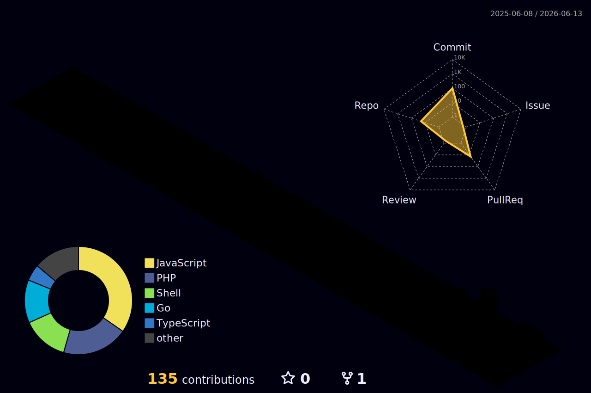

<h1 align="center">Hello,  I'm Kuuhaku</h1>
<h3 align="center">A fullstack developer from Morocco</h3>

### Connect with me

### Technologies & Tools

**Languages**

**Frameworks & Libraries**

**Databases**

**Tools & AI**

## 📈 GitHub stats

### Total contributions and streaks

### Most used languages

### GitHub Stats

  
  

  

